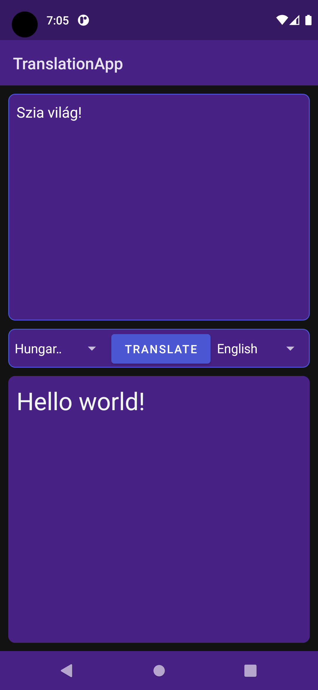

<h1 align="center">TranslationApp</h1>

  

<h2>An android translation app made with Android Studio</h2>

<h2>Description</h2>
<h3>The user can translate some text from a language to an other.  
This app is made with the <a href="https://rapidapi.com/armangokka/api/translo/">TransloAPI</a> may occur some server errors. If this happens with some languages report it in the <a href="https://rapidapi.com/armangokka/api/translo/discussions">discussions</a>
</h3>
